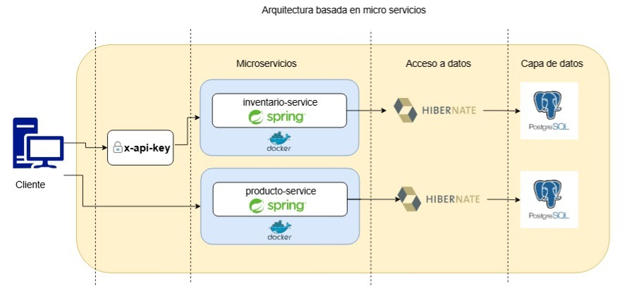
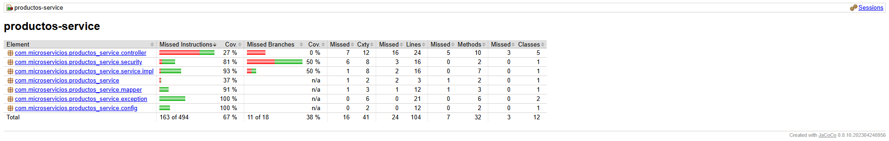
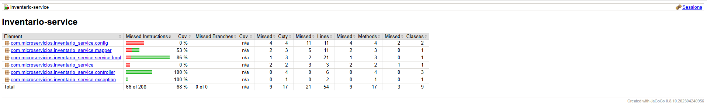

# Proyecto: Sistema de Microservicios para Gestión de Productos e Inventario

## ✨ Descripción General

Este proyecto consiste en un sistema de microservicios desarrollado para gestionar productos e inventario de manera
independiente y escalable. Cada servicio está diseñado con responsabilidades bien definidas y comunica mediante REST.

* `productos-service`: Permite la creación, consulta, actualización y eliminación de productos.
* `inventario-service`: Permite la consulta y actualización de inventario según el producto.

## ⚙️ Instalación y Ejecución

### Requisitos previos:

* Docker y Docker Compose
* Java 17
* Maven

### Pasos para ejecutar:

```bash
git clone https://github.com/usuario/proyecto.git
cd proyecto
docker-compose up --build
```

### Acceso a Swagger:

* Productos: `http://localhost:8080/swagger-ui.html`
* Inventario: `http://localhost:8081/swagger-ui.html`

## 🐳 Contenerización con Docker

Este proyecto está completamente contenerizado con Docker para asegurar su portabilidad y facilidad de despliegue. Se
incluye un archivo `docker-compose.yml` que orquesta los servicios `productos`, `inventario` y `PostgreSQL`.

👉 [Ver más sobre Docker y cómo levantar el sistema »](DOCKER.md)

## 🫠 Justificación Técnica

* **Lenguaje:** Java 17
* **Framework:** Spring Boot por su modularidad y facilidad de integración con microservicios
* **Base de datos:** PostgreSQL por ser robusta, gratuita y ampliamente usada en entornos productivos
* **Testing:** JUnit 5 y Mockito para pruebas unitarias confiables
* **Contenerización:** Docker para asegurar la portabilidad del entorno

## 🧩 Patrones de Diseño Aplicados

* **MVC (Modelo-Vista-Controlador):** Separación clara entre controlador (`@RestController`), servicio (`@Service`) y
  acceso a datos (`@Repository`).

* **DTO (Data Transfer Object):** Uso de objetos de transferencia de datos para desacoplar la lógica del modelo.

* **Singleton (Spring):** Todos los componentes anotados con `@Service`, `@Repository` y `@Controller` son singletons
  por defecto en Spring.

* **Repository:** Implementado a través de `JpaRepository` para manejar el acceso a datos.

* **Strategy (estructurable):** Aunque no implementado explícitamente, la arquitectura está preparada para aplicar este
  patrón si se requieren múltiples comportamientos intercambiables.

## 🔄 Diagrama de Arquitectura



## 🥺 Ejecución de Pruebas

Para correr las pruebas unitarias:

```bash
mvn test
```

* `productos-service`: 67% cobertura
* 
* `inventario-service`: 68% cobertura
* 

Ver más en [`COVERAGE.md`](COVERAGE.md) y [`PRUEBAS.md`](PRUEBAS.md).

## 📂 Estructura de Carpetas

```
├── productos-service/
├── inventario-service/
├── docker/
│   └── docker-compose.yml
├── README.md
├── ARQUITECTURA.md
├── COVERAGE.md
├── PRUEBAS.md
└── DOCKER.md
```
